# DCCF Robustness Study - Thesis Workflow Flowchart

## Visual Workflow Diagram

```mermaid
flowchart TD
    %% Problem Identification
    A[📚 Literature Review<br/>DCCF Analysis] --> B{🔍 Problem Identified<br/>DCCF assumes static noise<br/>Real-world noise is dynamic}
    
    %% Research Questions
    B --> C[ Research Questions<br/>RQ1: Static vs Dynamic Performance?<br/>RQ2: Burn-in effectiveness?<br/>RQ3: Exposure-aware DRO impact?]
    
    %% Hypothesis Formation
    C --> D[💡 Hypothesis<br/>DCCF degrades under dynamic noise<br/>Training-time fixes can help]
    
    %% Solution Design
    D --> E[🛠️ Solution Design<br/>Static Confidence Denoiser<br/>+ Burn-in Scheduling<br/>+ Exposure-aware DRO]
    
    %% Implementation Branch
    E --> F[⚙️ Implementation Phase]
    
    %% Core Implementation
    F --> G[🔧 Core Components<br/>Matrix Factorization + BPR<br/>Dynamic Noise Simulation<br/>Popularity Reweighting]
    
    %% Noise Patterns
    G --> H[🌊 Noise Pattern Design<br/>Static | Ramp | Burst | Shift]
    
    %% Baseline Models
    H --> I[📊 Baseline Models<br/>LightGCN | SimGCL<br/>NGCF | SGL]
    
    %% Experimental Design
    I --> J[🧪 Experimental Design<br/>4 Core + 4 Advanced Experiments]
    
    %% Core Experiments
    J --> K1[Static Baseline<br/>No noise, no solution]
    J --> K2[Static Solution<br/>No noise, with solution]
    J --> K3[Dynamic Baseline<br/>Dynamic noise, no solution]
    J --> K4[Dynamic Solution<br/>Dynamic noise, with solution]
    
    %% Advanced Experiments
    J --> L1[Burst Baseline<br/>Sudden noise spikes]
    J --> L2[Shift Baseline<br/>Focus changes head→tail]
    J --> L3[Additional Patterns<br/>Various noise levels]
    J --> L4[Baseline Comparison<br/>4 SOTA models]
    
    %% Results Collection
    K1 --> M[📈 Results Collection]
    K2 --> M
    K3 --> M
    K4 --> M
    L1 --> M
    L2 --> M
    L3 --> M
    L4 --> M
    
    %% Analysis Phase
    M --> N[🔬 Analysis Phase<br/>8 Academic Robustness Metrics<br/>Performance Comparison<br/>Pattern-specific Insights]
    
    %% Key Findings
    N --> O1[ Confirmed: Dynamic Vulnerability<br/>14.3% performance drop]
    N --> O2[🔍 Discovered: Burst Resilience<br/>+2.1% improvement]
    N --> O3[💥 Breakthrough: Shift Benefits<br/>+17.5% improvement]
    N --> O4[🎯 Solution Effectiveness<br/>Pattern-dependent results]
    
    %% Thesis Contributions
    O1 --> P[🏆 Thesis Contributions]
    O2 --> P
    O3 --> P
    O4 --> P
    
    %% Final Deliverables
    P --> Q[📋 Final Deliverables<br/>Comprehensive Analysis<br/>Academic Tables<br/>Reproducible Framework<br/>Novel Insights]
    
    %% Styling
    classDef problemBox fill:#ffebee,stroke:#d32f2f,stroke-width:2px
    classDef solutionBox fill:#e8f5e8,stroke:#388e3c,stroke-width:2px
    classDef experimentBox fill:#e3f2fd,stroke:#1976d2,stroke-width:2px
    classDef resultBox fill:#fff3e0,stroke:#f57c00,stroke-width:2px
    classDef contributionBox fill:#f3e5f5,stroke:#7b1fa2,stroke-width:2px
    
    class A,B,C problemBox
    class D,E,G solutionBox
    class F,H,I,J,K1,K2,K3,K4,L1,L2,L3,L4 experimentBox
    class M,N,O1,O2,O3,O4 resultBox
    class P,Q contributionBox
```

## Detailed Process Breakdown

### Phase 1: Problem Identification & Research Design


### Phase 2: Solution Architecture


### Phase 3: Experimental Framework


### Phase 4: Key Discoveries & Results

```mermaid
flowchart TD
    A[Experimental Results] --> B[Expected Findings]
    A --> C[Unexpected Discoveries]
    
    B --> B1[ Dynamic Vulnerability Confirmed<br/>14.3% performance drop]
    B --> B2[ Solution Effectiveness<br/>Reduces drop to 12.9%]
    
    C --> C1[🔍 Burst Resilience Discovery<br/>+2.1% improvement under spikes]
    C --> C2[💥 Shift Benefits Breakthrough<br/>+17.5% improvement with focus change]
    C --> C3[🎯 Pattern-Dependent Behavior<br/>Three distinct DCCF modes identified]
```


## Implementation Timeline & Workflow

### Sequential Development Process


## Technical Architecture Flow

### Data Flow Through System


## Solution Components Integration

### How Components Work Together

```mermaid
flowchart TD
    A[Training Epoch Starts] --> B{Burn-in Phase?<br/>Epoch ≤ 10}
    
    B -->|Yes| C[Easy Training Regime<br/>Minimal reweighting<br/>No DRO]
    B -->|No| D[Full Solution Active<br/>Complete reweighting<br/>DRO enabled]
    
    C --> E[Apply Noise Schedule<br/>Static/Ramp/Burst/Shift]
    D --> E
    
    E --> F[Popularity Reweighting<br/>Down-weight popular items]
    
    F --> G[Model Forward Pass<br/>BPR Loss Calculation]
    
    G --> H[Backward Pass<br/>Parameter Updates]
    
    H --> I{Training Complete?}
    I -->|No| A
    I -->|Yes| J[Final Evaluation<br/>Robustness Analysis]
```


## Research Contribution Framework

### Novel Contributions Hierarchy


This comprehensive flowchart provides multiple views of your thesis workflow, from high-level process flow to detailed technical implementation. It should help your lecturer understand the complete research methodology, solution architecture, and novel contributions of your work.
